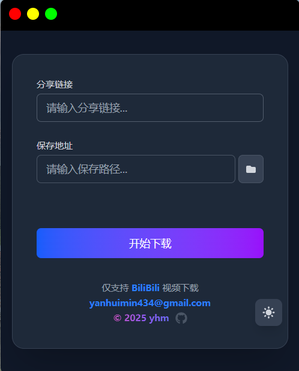
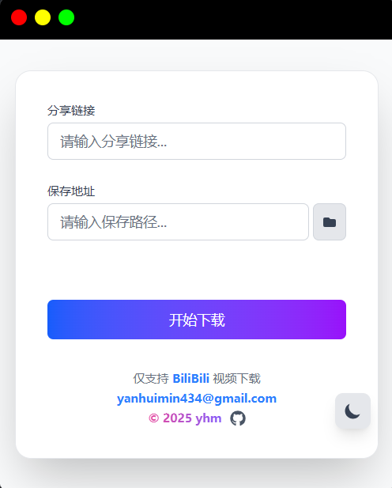

# *BiliBili-Downloader*

  

## :scroll: 如何使用

在B站选择想要下载的视频的分享链接，输入到该软件中，选择想要保存的文件路径，点击下载即可，软件显示下载成功后不会立刻显示在文件夹中，可能会有15-20秒钟左右的延迟。

## **:sunny: /:first_quarter_moon_with_face:** 支持黑夜和白天两种主题

点击右下方的按键即可切换主题。

******

> :sunny:白昼：
>
> 

******

> :first_quarter_moon_with_face: 黑夜：
>
> 

******

