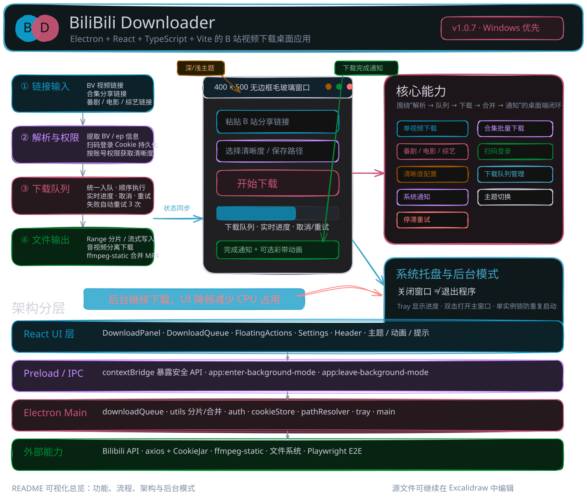

<div align="center">


# 🎬 BiliDownload

**一款基于 Electron 的 B 站视频下载桌面应用**

<p>
  <a href="https://github.com/Yan-huimin/BiliBili-Downloader">
    
  </a>
  <a href="https://www.electronjs.org/">
    
  </a>
  <a href="https://react.dev/">
    
  </a>
  <a href="https://www.typescriptlang.org/">
    
  </a>
  <a href="https://tailwindcss.com/">
    
  </a>
  <a href="https://vite.dev/">
    
  </a>
</p>

<p>
  
  
  
  
</p>



</div>

## ✨ 项目简介

BiliDownload 是一个固定 `400 x 500` 无边框窗口的 B 站视频下载工具，主界面采用毛玻璃、网格背景和深浅主题切换设计。你可以粘贴 B 站分享链接，选择保存目录，然后把视频加入下载队列；扫码登录后，可下载账号权限范围内的更高清晰度内容。

项目支持普通视频、合集、番剧、电影和综艺内容识别，内置下载队列、下载历史、失败重试、后台托盘、系统通知和 `ffmpeg-static` 音视频合并能力。

## 🚀 核心功能

| 能力 | 说明 |
| --- | --- |
| 🔗 分享链接识别 | 支持从 B 站分享链接中提取 BV 号，并识别普通视频、合集、番剧、电影、综艺等类型。 |
| 📺 多清晰度下载 | 支持 360p、480p、720p、1080p、1080p60、4K 等清晰度，实际可用清晰度取决于账号权限。 |
| 📱 扫码登录 | 支持 B 站二维码登录，Cookie 会持久化保存，方便后续继续使用。 |
| 🎞️ 音视频合并 | 视频和音频分离下载后，通过 `ffmpeg-static` 自动合并为 MP4 文件。 |
| 📦 合集批量下载 | 获取合集内视频列表，自由勾选需要下载的条目，一次性加入下载队列。 |
| 🎭 番剧/电影/综艺 | 自动展示剧集或期数列表，支持选择具体集数批量下载。 |
| 🧾 下载队列 | 所有任务统一进入队列，支持实时进度、取消、重试、清空和状态查看。 |
| 🕘 下载历史 | 下载入队时保存分享链接、内容名称和时间，最多保留 30 条；支持复制链接、单条删除和全部清空。 |
| 🛡️ 自动重试 | 单个视频失败最多自动重试 3 次，流式下载停滞时会自动中止并重试。 |
| 🖥️ 托盘后台 | 可选择关闭窗口时最小化到系统托盘并继续下载，托盘图标可展示下载进度，并通过单实例锁避免重复启动。 |
| 🎨 个性化设置 | 支持默认下载目录、默认清晰度、系统通知、彩带特效、关闭窗口行为、深浅主题等配置。 |

## 🖼️ 截图预览

### 🌙 深色主题


### ☀️ 浅色主题


## 🧭 使用方式

### 🎯 单个视频下载

1. 打开应用。
2. 将 B 站视频分享链接粘贴到“分享链接”输入框。
3. 输入或选择保存路径。
4. 点击“开始下载”，任务会自动加入下载队列。

### 📚 合集批量下载

1. 粘贴合集分享链接到输入框。
2. 点击右上角 **fx** 菜单，选择“获取合集”。
3. 在合集列表中勾选需要下载的视频，默认会选中当前链接对应的视频。
4. 点击“下载”，所选视频会批量加入下载队列。

### 🎬 番剧、电影、综艺下载

1. 粘贴番剧、电影或综艺分享链接到输入框。
2. 应用会自动识别链接类型，并展示剧集或期数列表。
3. 勾选需要下载的条目，也可以一键全选。
4. 点击“下载”，所选内容会批量加入下载队列。

### 🧾 下载队列管理

1. 点击右上角 **fx** 菜单，选择“下载队列”。
2. 查看任务状态：等待中、下载中、合并中、已完成、失败。
3. 对等待中或下载中的任务执行取消操作。
4. 对失败任务点击“重试”，重新加入队列。
5. 点击“清空下载队列”清理全部任务。

### 🕘 下载历史管理

1. 普通视频或列表内容成功加入下载队列时，应用会保存本次输入的分享链接。
2. 点击右上角 **fx** 菜单，选择“下载历史”。
3. 查看对应的视频、合集、番剧或 UP 主名称以及记录时间。
4. 点击复制按钮将分享链接写入系统剪贴板，或点击删除按钮移除单条记录。
5. 点击“清空全部历史记录”并确认，可删除全部记录。

重复下载同一个链接时，原记录会更新时间并移动到列表顶部。应用最多保留 30 条历史记录。

### 🖥️ 设置关闭窗口行为

1. 点击右上角 **fx** 菜单，打开“设置”。
2. 在“关闭窗口时”选择“最小化到系统托盘”或“直接退出应用”。
3. 保存配置后立即生效；直接退出会中止尚未完成的下载任务。

> 需要下载高清、4K 等内容时，请先登录拥有对应权限的 B 站账号。

## 🧱 技术栈

| 模块 | 技术 |
| --- | --- |
| 桌面端 | Electron 36 |
| 前端框架 | React 19 |
| 开发语言 | TypeScript 5.7 |
| 构建工具 | Vite 6 |
| 样式方案 | Tailwind CSS 4 + 局部 CSS |
| 动画效果 | Framer Motion + canvas-confetti |
| 图标与二维码 | react-icons、react-qr-code、qrcode.react |
| 网络与 Cookie | axios、axios-cookiejar-support、tough-cookie |
| 视频处理 | ffmpeg-static |
| 端到端测试 | Playwright |
| 打包发布 | electron-builder |

## 📂 项目结构

```text
src/
  electron/                 Electron 主进程、IPC、下载队列与业务逻辑
    appIdentity.ts          应用名称与 AppUserModelId
    bilibiliAuthService.ts  B 站扫码登录逻辑
    bilibiliClient.ts       axios 客户端与 CookieJar
    bangumiService.ts       番剧、电影、综艺信息服务
    collectionService.ts    合集信息获取服务
    cookieStore.ts          Cookie 持久化
    createWindows.ts        窗口创建
    downloadQueue.ts        下载队列服务
    historyService.ts       下载历史持久化与标题解析
    ipcEventHandler.ts      IPC 事件注册与分发
    pathResolver.ts         路径解析
    settingsService.ts      设置校验、兼容、缓存与持久化
    tray.ts                 系统托盘、进度显示与单实例处理
    utils.ts                下载核心、音视频合并与 Cookie 管理
  ui/
    components/             React 展示组件
    hooks/                  下载、合集、队列、设置、登录等 hooks
    stores/                 全局运行时与设置状态
    constants/              清晰度等静态配置
    utils/                  分享链接校验等工具
    css/                    主界面、面板与弹窗样式
public/                     README 截图与公共静态资源
e2e/                        Playwright 端到端测试
types.d.ts                  全局类型定义
```

## 🛠️ 本地开发

```bash
# 安装依赖
npm install

# 同时启动 React 和 Electron
npm run dev

# 只启动 React 开发服务
npm run dev:react

# 编译并启动 Electron 开发环境
npm run dev:electron

# 类型检查并构建前端产物
npm run build
```

开发模式下，React 服务默认运行在 `http://localhost:5123`。

## 📦 打包

```bash
# macOS ARM64
npm run dist:mac

# Windows x64
npm run dist:win

# Linux x64
npm run dist:linux
```

Windows 会输出 `portable` 和 `nsis` 安装包，Linux 会输出 `AppImage`，macOS 会输出 `dmg`。

## ✅ 测试

```bash
npm run test:e2e
```

E2E 测试会为每个测试套件创建独立的临时用户数据目录，并预设为直接退出应用。测试数据不会污染日常使用的设置、登录 Cookie 或下载历史，测试结束后会自动清理。

如果系统配置了 HTTP/HTTPS 代理，请确保 `localhost` 和 `127.0.0.1` 不经过代理。例如在 PowerShell 中：

```powershell
$env:HTTP_PROXY=''
$env:HTTPS_PROXY=''
$env:NO_PROXY='localhost,127.0.0.1,::1'
npm run test:e2e
```

如果本机还没有安装 Playwright 浏览器，请先执行：

```bash
npx playwright install
```

## 📌 环境要求

- Node.js 18 或更高版本
- npm 9 或更高版本
- Windows、macOS 或 Linux 桌面环境

## ⚠️ 注意事项

- 支持包含 BV 号的 B 站视频链接，以及番剧、电影、综艺等类型的分享链接。
- 高清、4K 等清晰度是否可用，取决于登录账号权限和 B 站接口返回结果。
- 下载失败的视频会自动重试最多 3 次；流式下载无活动时会自动中止并重试。
- 下载历史和应用设置保存在 Electron 的用户数据目录中；下载历史最多保留 30 条。
- 选择“直接退出应用”时，尚未完成的下载任务会被中止。
- 本项目仅用于学习与个人使用，请遵守 B 站用户协议和相关版权规定。

## 🙋 作者

© 2025 yhm  
GitHub: [Yan-huimin](https://github.com/Yan-huimin)
