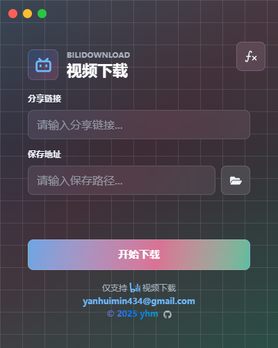
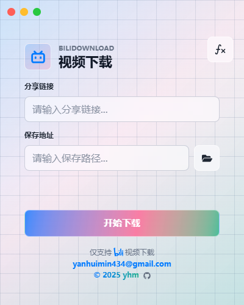

# BiliBili Downloader

[](https://github.com/Yan-huimin/BiliBili-Downloader)
[](https://react.dev)
[](https://tailwindcss.com)
[](https://www.typescriptlang.org)
[](https://www.electronjs.org)
[](https://vite.dev)

一个基于 Electron、React、TypeScript 和 Tailwind CSS 的 B 站视频下载桌面应用。

应用采用固定 `400 x 500` 的无边框窗口，主界面是带网格背景的毛玻璃风格。你可以粘贴 B 站视频分享链接，选择保存目录，然后下载视频；登录后可使用账号权限内的更高清晰度。



## 功能

- 支持从分享链接中提取 BV 号并获取视频地址。
- 支持 360p、480p、720p、720p 高帧率、1080p、1080p 高码率、1080p60、4K 等清晰度配置。
- 支持 B 站扫码登录，登录 Cookie 会持久化保存。
- 支持视频和音频分离下载后通过 `ffmpeg-static` 自动合并为 MP4。
- 大文件使用 Range 分片下载，小文件自动走单次下载。
- 支持实时下载进度条。
- 支持默认下载目录、默认清晰度、系统通知和彩带特效配置。
- 支持下载完成后的系统通知和可选彩带动画。
- 自定义 Electron 标题栏，保留关闭、最小化和最大化按钮。
- 支持深色和浅色主题切换，默认深色主题。

## 截图

### 深色主题


### 浅色主题



## 使用方式

1. 打开应用。
2. 将 B 站视频分享链接粘贴到“分享链接”输入框。
3. 输入或选择保存路径。
4. 按需打开右上角工具菜单，登录账号或调整设置。
5. 点击“开始下载”。

如果需要下载更高清晰度，请先扫码登录拥有对应权限的 B 站账号。

## 技术栈

| 模块 | 技术 |
| --- | --- |
| 桌面端 | Electron 36 |
| 前端 | React 19 |
| 样式 | Tailwind CSS 4 + 局部 CSS |
| 语言 | TypeScript 5.7 |
| 构建 | Vite 6 |
| 动画 | Framer Motion |
| 图标 | react-icons |
| 二维码 | react-qr-code |
| HTTP 与 Cookie | axios、axios-cookiejar-support、tough-cookie |
| 视频合并 | ffmpeg-static |
| 测试 | Playwright |

## 项目结构

```text
src/
  electron/              Electron 主进程、IPC、下载和 B 站接口逻辑
  ui/
    components/          React 展示组件
    hooks/               下载、设置、登录、弹窗等自定义 hooks
    constants/           清晰度等静态配置
    css/                 毛玻璃界面与弹窗样式
public/                  README 截图与公共静态资源
e2e/                     Playwright 端到端测试
```

## 开发

```bash
# 安装依赖
npm install

# 同时启动 React 和 Electron
npm run dev

# 只启动 React 开发服务
npm run dev:react

# 编译并启动 Electron 开发环境
npm run dev:electron

# 类型检查并构建前端产物
npm run build
```

开发模式下 React 服务默认运行在 `http://localhost:5123`。

## 打包

```bash
# macOS ARM64
npm run dist:mac

# Windows x64
npm run dist:win

# Linux x64
npm run dist:linux
```

## 测试

```bash
npm run test:e2e
```

如果本机还没有 Playwright 浏览器，需要先执行：

```bash
npx playwright install
```

## 环境要求

- Node.js 18 或更高版本
- npm 9 或更高版本
- Windows、macOS 或 Linux 桌面环境

## 注意事项

- 当前主要面向包含 BV 号的 B 站视频链接。
- 高清、4K 等清晰度取决于登录账号权限和 B 站接口返回结果。
- 下载内容请遵守 B 站用户协议和相关版权规定，本项目仅用于学习与个人使用。

## 作者

© 2025 yhm  
GitHub: [Yan-huimin](https://github.com/Yan-huimin)
